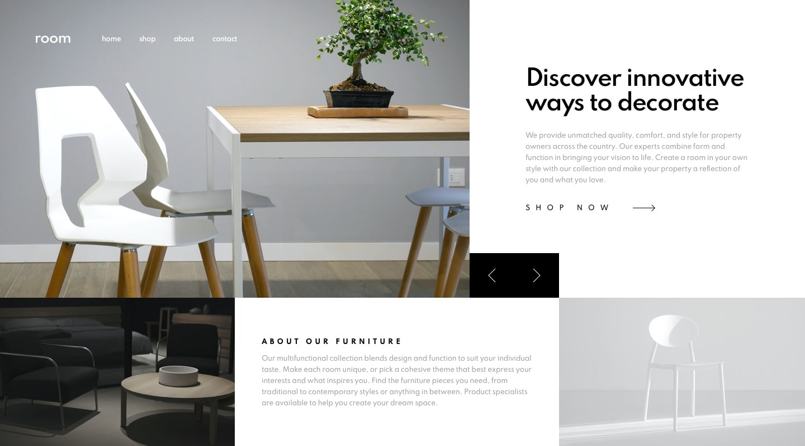

# **Furniture HTML-CSS-JavaScript**

> ## **_Description_**

The challenge I will use two different skills, one is pure html/css/javascript and the other is react.

Mobile friendly and working functionally.

---

### **_Table of Contents_**

- [Usage](#usage)
- [Screen Shots](#Screen-shots)
- [Demo](#demo)
- [Features](#features)
- [Contribution](#contribution)
- [License](#license)

> ## **_Usage_**

Basic HTML CSS vanilla JavaScript

> ## **_Screen-shots_**

**`Wider Screen`**

> ## **_Demo_**

https://albertjly.github.io/furniture-html/

> ## **_Features_**

- Multiple pages

> ## **_Contributing_**

Albert Jiang

❤️

If you created an application or package and would like other developers to contribute it, you will want to add guidelines for how to do so. The [Contributor Covenant](https://www.contributor-covenant.org/) is an industry standard, but you can always write your own.

> ## **_License_**

Copyright (c) [2021] [Luyang Jiang]

https://choosealicense.com/licenses/mit/
